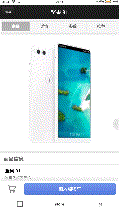

# OneStore

在线商城 WebAPP

### 前言

这个 webAPP 是一个在线购物商场移动端 web，它具有一个在线商城购物的基本流程，商品展示，商品详情展示，商品分类，登录，地址管理，购物管理，下单流程，UI 样式基于锤子商城移动端，个别界面进行了二次更改，故波动有点大，因此美观一般。

### 技术栈

Vue2 + Vuex + Vue-router + webpack + ES6 + axios + stylus + node + mongoDB

### 关于接口数据

接口数据是抓取的锤子商城在线的一些数据，本地进行了转存数据库，然后使用 node + express 构建提供 API 接口，完成前端数据的提供。

### 效果图

### 目标功能

[x] 商品展示
[x] 商品详情展示
[x] 商品分类
[x] 登录
[x] 地址管理（增删改查）
[x] 购物车管理（增删改查）
[x] 下单流程（未开发支付接口）
[x] 图片懒加载

### 最后

store 文件夹为前端界面文件存放地址  
server 文件夹为后端接口文件存放地址  
mock 文件夹为数据库文件存放地址  
本地运行需要将数据库文件导入 mongoDB 数据后  
store 文件下运行  
`npm run dev`  
server 文件下运行  
`npm run server`
